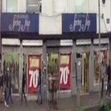

# Fine-Tuning Florence for Shopfront Description and Classification

## 📌 Project Overview
This project focuses on **fine-tuning the Florence multimodal model** to describe shopfronts in street view images, and then applying **Flan-T5** to classify the generated shop descriptions into relevant categories.  

The workflow consists of:
1. Preparing training data (images + text descriptions).
2. Fine-tuning Florence on the shopfront dataset.
3. Evaluating multiple fine-tuned models and selecting the best-performing one.
4. Using the selected Florence model to describe new shopfront images.
5. Applying Flan-T5 for shop classification based on the generated descriptions.

---

## 📂 Repository Structure
├── processed/ # Training images used for fine-tuning Florence
├── captions.jsonl # Text descriptions for images in processed/
├── florence_finetune_new.ipynb # Notebook for fine-tuning Florence
├── florence2_val5.ipynb # Notebook for evaluating models and classification
└── README.md

---

## ✨ Improvement Example
Below is a comparison of Florence's description ability **before and after fine-tuning**:

📷 Example shopfront image:  


- **Before fine-tuning:**  
  *"The image shows a group of people walking down the street in front of a store, with a building in the background. The image is slightly blurred, giving it a dreamy quality."*

- **After fine-tuning:**  
  *"A clothing store with a blue and white sign reading 'Fray Jop' and red sign saying '70'. The store displays a variety of clothing and accessories, suggesting it is a clothing store."*

---

## ⚙️ Workflow

### 1. Data Preparation
- `processed/` contains street view images of shopfronts.
- `captions.jsonl` provides text descriptions for each image, used as ground truth during fine-tuning.

### 2. Model Fine-Tuning
- `florence_finetune_new.ipynb`  
  - Loads the Florence model.  
  - Fine-tunes it on `processed/` + `captions.jsonl`.  
  - Saves checkpoints of the trained models.  

### 3. Model Evaluation & Selection
- `florence2_val5.ipynb`  
  - Evaluates multiple fine-tuned Florence models.  
  - Compares accuracy and selects the best-performing model.  

### 4. Shopfront Description
- The selected Florence model is used to generate textual descriptions of shopfronts from street view images.  

### 5. Shop Classification
- The generated descriptions are passed to **Flan-T5**, which classifies shops into categories (e.g., restaurants, clothing stores, etc.).  
- The classification is done using a carefully designed prompt. Example:

```python
def build_prompt(description: str) -> str:
    return f"""
You are given a description of a storefront. Classify it into one of the following five categories:

1. Retail – includes clothing stores, electronics shops, supermarkets, convenience stores, and home goods stores.
2. Food & Beverage – includes restaurants, cafés, bakeries, takeaway shops, fast food vendors, and bars.
3. Service-Oriented – includes pharmacies, optical stores, hair salons, internet cafés, photo studios, and financial offices.
4. Industrial & Repair – includes hardware stores, car repair shops, electrical suppliers, refrigeration services, and workshops.
5. Other – used for storefronts that cannot be identified due to blurry photos, unclear signage, or vague descriptions.

Answer with only the category number (1 to 5).

Store description: "{description}"  
""".strip()

For example, if Florence generates the description
"A small shop with a sign reading "Ferrelectricos" and a large electrical wire inside. The shop appears to be a hardware store, likely used for electrical equipment.",
the prompt will guide Flan-T5 to classify it as 4 (Industrial & Repair).
---

## 🚀 Usage

1. Clone the repository:
   ```bash
   git clone https://github.com/annashen98/Fine-Tune-Multimodial-Models.git
   cd Fine-Tune-Multimodial-Models
